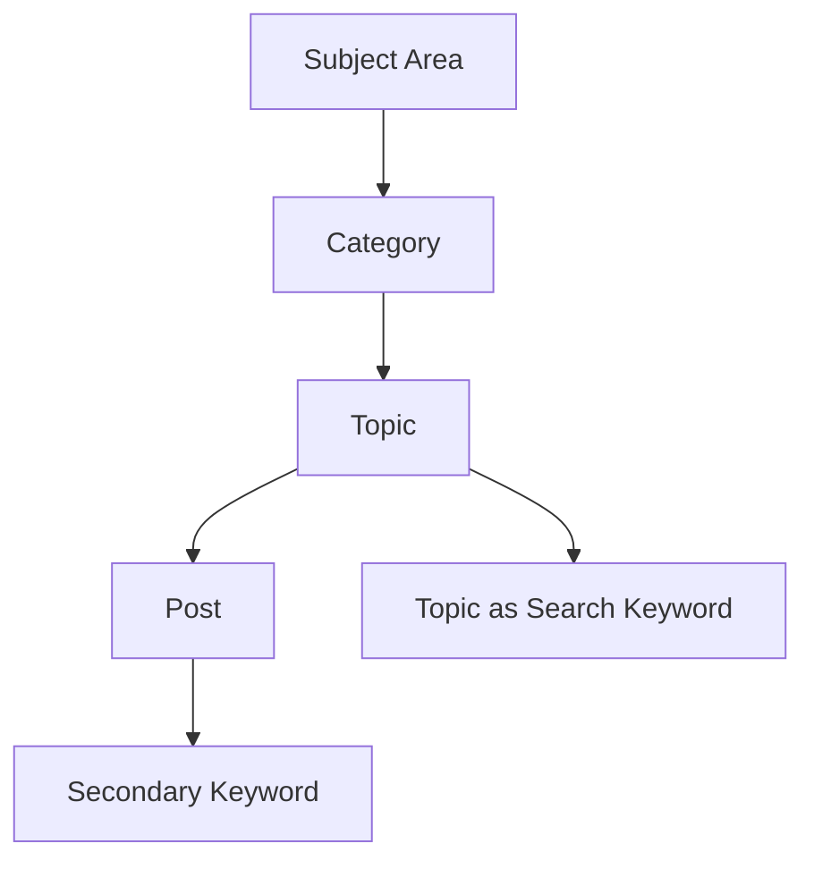
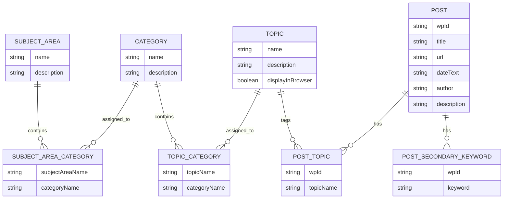

# Ehrman Blog JSON Integration Guide for WordPress

This document describes the JSON files used by the Ehrman search demo and how a WordPress developer can import them into a production WordPress implementation.

The JSON files define a topic-browsing and keyword-search layer for Bart Ehrman's blog posts. They are intended to support:

- Subject-area browsing
- Category browsing
- Topic browsing
- Topic-to-post result pages
- Keyword search with autocomplete
- Post descriptions shown in search or hover states

## Source Files

The current integration package uses four JSON files:

```text
data/index/ehrman_post_subject_areas.json
data/index/ehrman_post_categories.json
data/index/ehrman_post_topics.json
data/index/ehrman_post_search_index.json
```

These files are related, but they serve different purposes.

| File | Purpose | Approximate size |
| --- | --- | ---: |
| `ehrman_post_subject_areas.json` | Defines broad subject areas and their category links. | 5 KB |
| `ehrman_post_categories.json` | Defines category names, descriptions, and topic display order. | 23 KB |
| `ehrman_post_topics.json` | Defines topic names, descriptions, category links, and browser visibility. | 87 KB |
| `ehrman_post_search_index.json` | Defines post-level metadata, topic links, secondary keywords, and descriptions. | 2.5 MB |

## Current Record Counts

As of the current local data:

| Item | Count |
| --- | ---: |
| Subject areas | 11 |
| Subject-area/category links | 41 |
| Categories | 41 |
| Topic metadata records | 252 |
| Topics displayed in browser | 251 |
| Hidden topics | 1 |
| Category-topic links | 299 |
| Posts | 4,381 |
| Unique post URLs | 4,381 |
| Duplicate post titles | 36 |
| Posts with no topics | 0 |
| Posts with no secondary keywords | 500 |

The duplicate-title count is expected. Do not use title as the unique identifier. Use `wpId` when it matches the production WordPress post ID; otherwise use `url`.

## Conceptual Model

The browsing model has four levels:

1. A **Subject Area** is the broadest grouping and contains related categories.
2. A **Category** is a focused grouping of related topics.
3. A **Topic** is a specific subject used to connect related posts. A topic can belong to more than one category.
4. A **Post** can have one or more topics and zero or more secondary keywords.



Topics function as the primary topic tags for posts. Secondary keywords add supporting search terms that are not always broad enough to be topics.

## Entity Relationship Diagram



## File 1: `ehrman_post_subject_areas.json`

### Purpose

This file defines the broad subject areas shown at the start of Browse by Topic and links each subject area to its categories.

### Top-Level Shape

```json
{
  "subjectAreas": [
    {
      "name": "Jesus, the Gospels, and Acts",
      "description": "Covers the canonical Gospels, Acts, major New Testament figures, and traditions about Jesus' life, teachings, death, burial, and resurrection.",
      "categories": [
        "The Historical Jesus",
        "Canonical Gospels and Acts"
      ]
    }
  ]
}
```

### Schema

| Field | Type | Required | Notes |
| --- | --- | --- | --- |
| `subjectAreas` | array | yes | Top-level subject-area records. |
| `subjectAreas[].name` | string | yes | Unique display name for the subject area. |
| `subjectAreas[].description` | string | yes | One-sentence subject-area description. |
| `subjectAreas[].categories` | array of strings | yes | Ordered category names from `ehrman_post_categories.json`. |

### WordPress Use

Recommended tables:

```text
ehrman_subject_areas
- id
- name
- slug
- description
- sort_order

ehrman_subject_area_categories
- subject_area_id
- category_id
- sort_order
```

Use the JSON order for both subject areas and their category links.

## File 2: `ehrman_post_categories.json`

### Purpose

This file defines the categories shown after a reader selects a subject area.

### Top-Level Shape

```json
{
  "categories": [
    {
      "name": "Acts and Early Christianity",
      "description": "Covers Acts and the earliest Christian movement, including conversion, communities, evangelism, miracles, Paul in Acts, and Christian expansion."
    }
  ]
}
```

### Schema

| Field | Type | Required | Notes |
| --- | --- | --- | --- |
| `categories` | array | yes | Top-level category records. |
| `categories[].name` | string | yes | Unique display name for the category. |
| `categories[].description` | string | yes | One-sentence category description. |

### WordPress Use

Recommended storage options:

- Custom database table: `ehrman_topic_categories`
- Or custom taxonomy parent terms, if using WordPress taxonomies

Recommended fields:

```text
id
name
slug
description
sort_order
```

Use the JSON order as the default display order unless the site wants alphabetical ordering.

## File 3: `ehrman_post_topics.json`

### Purpose

This file defines all topics, their descriptions, the categories they belong to, and whether they should appear in the browser.

### Top-Level Shape

```json
{
  "topics": [
    {
      "name": "Acts (General)",
      "description": "Posts introducing Acts, its literary features, major topics, theology, and account of Christianity's spread from Jerusalem to Rome.",
      "categories": [
        "Acts and Early Christianity"
      ],
      "displayInBrowser": true
    }
  ]
}
```

### Schema

| Field | Type | Required | Notes |
| --- | --- | --- | --- |
| `topics` | array | yes | Top-level topic records. |
| `topics[].name` | string | yes | Unique topic name. |
| `topics[].description` | string | yes | One-sentence topic description. |
| `topics[].categories` | array of strings | yes | Category names from `ehrman_post_categories.json`. May contain more than one category. |
| `topics[].displayInBrowser` | boolean | yes | If false, the topic should not appear in category/topic browsing. |

### Important Topic Rules

- Topic names must match exactly between `ehrman_post_topics.json` and post `topics` arrays in `ehrman_post_search_index.json`.
- Category names in `topics[].categories` must match category `name` values exactly.
- A topic can belong to more than one category.
- `Ignore` is a valid topic, but it has `displayInBrowser: false` and should not appear in the browsing UI.

### WordPress Use

Recommended storage options:

- Custom taxonomy `ehrman_topic`
- Or custom table `ehrman_topics`

Because topics can belong to multiple categories, do not assume a simple parent-child taxonomy is enough unless the implementation supports many-to-many relationships.

Recommended tables:

```text
ehrman_topics
- id
- name
- slug
- description
- display_in_browser

ehrman_topic_categories
- topic_id
- category_id
```

## File 4: `ehrman_post_search_index.json`

### Purpose

This is the post-level search index. It contains post metadata, post descriptions, topic assignments, and secondary keywords.

Despite the earlier working filename, this is not merely a keyword file. It is the main post search index.

### Top-Level Shape

This file is a top-level array of post records:

```json
[
  {
    "wpId": "50126",
    "title": "Christian Justifications for Lying",
    "url": "https://ehrmanblog.org/christian-justifications-for-lying/",
    "dateText": "July 9, 2026",
    "author": "BDEhrman",
    "description": "Examines whether early Christian forgers could justify deception as a noble lie, contrasting that view with Augustine's rejection of all lying.",
    "topics": [
      "Forgery (General)",
      "Moral Philosophy"
    ],
    "secondaryKeywords": [
      "Noble Lie",
      "Augustine",
      "Plato",
      "Lying",
      "Christian Forgery",
      "Forged",
      "Forgery and Counterforgery"
    ]
  }
]
```

### Schema

| Field | Type | Required | Notes |
| --- | --- | --- | --- |
| `wpId` | string | yes | WordPress post ID from the source system, stored as a string. |
| `title` | string | yes | Display title. Not unique. |
| `url` | string | yes | Canonical post URL. Unique in this dataset. |
| `dateText` | string | yes | Human-readable date, such as `July 9, 2026`. |
| `author` | string | yes | Author display name. |
| `description` | string | yes | Brief post description for result pages and hover/display states. |
| `topics` | array of strings | yes | Primary topic topics. Values must match `ehrman_post_topics.json`. |
| `secondaryKeywords` | array of strings | yes | Supporting search keywords. May be empty. |

### WordPress Use

Recommended post matching order:

1. Match by `wpId` if it is confirmed to be the production WordPress post ID.
2. If `wpId` is not reliable in production, match by canonical `url`.
3. Do not match by `title`, because some titles are duplicated.

Recommended storage:

```text
ehrman_post_index
- wp_post_id
- source_wp_id
- canonical_url
- title
- author
- date_text
- description

ehrman_post_topics
- wp_post_id
- topic_id

ehrman_post_secondary_keywords
- wp_post_id
- keyword
- normalized_keyword
```

The `description` field could also be stored as post meta, for example:

```text
_ehrman_search_description
```

## Import Order

Import in this order:


## Search Behavior

The current demo searches against:

- Topic names from each post's `topics` array
- Secondary keywords from each post's `secondaryKeywords` array

In production, the topic names should be treated as primary search keywords. The secondary keywords should support narrower searches, autocomplete, and ranking.

Recommended search matching:

1. Normalize query terms by lowercasing and removing punctuation.
2. Search exact normalized keyword matches first.
3. Rank posts higher when a query term matches a topic.
4. Rank posts lower when a query term matches only a secondary keyword.
5. For multi-keyword searches, require all entered keywords to match unless the UI explicitly supports "any term" searching.

Example ranking model:

| Match type | Suggested score |
| --- | ---: |
| Topic match | 5 |
| Secondary keyword match | 2 |
| Title match, if added later | 1 |

## Suggested WordPress Architecture

For a production site, use a plugin rather than embedding the full JSON in a static HTML file.

Recommended plugin pieces:

```text
ehrman-topic-browser/
- ehrman-topic-browser.php
- includes/
  - class-importer.php
  - class-search-index.php
  - class-rest-controller.php
  - class-shortcodes.php
- assets/
  - topic-browser.js
  - topic-browser.css
```

Suggested shortcodes or blocks:

```text
[ehrman_browse_topics]
[ehrman_keyword_search]
[ehrman_topic_results]
```

Suggested REST endpoints:

```text
GET /wp-json/ehrman/v1/subject-areas
GET /wp-json/ehrman/v1/subject-areas/{slug}/categories
GET /wp-json/ehrman/v1/categories
GET /wp-json/ehrman/v1/categories/{slug}/topics
GET /wp-json/ehrman/v1/topics/{slug}/posts
GET /wp-json/ehrman/v1/search?keywords=paul+resurrection
GET /wp-json/ehrman/v1/keywords?prefix=pa
```

## Validation Checklist

After import, the developer should confirm:

- 11 subject areas imported.
- 41 subject-area/category links exist.
- 41 categories imported.
- 252 topic records imported.
- 251 topics are visible in the browser.
- 1 topic is hidden: `Ignore`.
- 299 category-topic links exist.
- 4,381 post records imported or matched.
- 4,381 unique URLs exist.
- Every post has at least one topic.
- Every subject-area category exists in the category metadata.
- Every post topic exists in the topic metadata.
- Every topic category exists in the category metadata.
- Duplicate titles are allowed.
- URLs or confirmed WordPress IDs are used as the unique post key.

## Display Rules

### Subject Area Page

Show:

- Subject-area name
- Subject-area description on hover or when descriptions are enabled
- Category count
- Topic count
- Post count
- Linked categories

### Category Page

Show:

- Category name
- Category description
- Topic count
- Post count

### Topic Page

Show:

- Category name or navigation context
- Topic name
- Topic description
- Post count
- Matching posts

### Post Result Rows

Show:

- Linked post title
- `By {author} | {dateText} | {selected topic}`
- Description on hover or when the user enables "display all descriptions"

The selected topic should be the topic the user clicked or searched from, not necessarily the first topic in the post's `topics` array.

## Production Notes

- Do not load and parse the JSON files on every public request.
- Import the JSON into WordPress tables or cached options.
- Build normalized keyword lookup tables for fast autocomplete and search.
- Cache subject-area, category, topic, and search-result counts.
- Preserve exact subject-area, category, and topic names for display, but create slugs for URLs.
- Keep a re-import process so future JSON updates can refresh the WordPress data.
- Treat the JSON files as source data, not as the live runtime database.

## Minimal Import Pseudocode

```php
$subject_areas = json_decode(file_get_contents('ehrman_post_subject_areas.json'), true)['subjectAreas'];
$categories = json_decode(file_get_contents('ehrman_post_categories.json'), true)['categories'];
$topics = json_decode(file_get_contents('ehrman_post_topics.json'), true)['topics'];
$posts = json_decode(file_get_contents('ehrman_post_search_index.json'), true);

$subject_area_ids = [];
foreach ($subject_areas as $subject_area) {
    $subject_area_ids[$subject_area['name']] = upsert_subject_area(
        $subject_area['name'],
        $subject_area['description']
    );
}

foreach ($categories as $category) {
    upsert_category($category['name'], $category['description']);
}

foreach ($subject_areas as $subject_area) {
    foreach ($subject_area['categories'] as $category_name) {
        link_subject_area_to_category(
            $subject_area_ids[$subject_area['name']],
            find_category_id($category_name)
        );
    }
}

foreach ($topics as $topic) {
    $topic_id = upsert_topic(
        $topic['name'],
        $topic['description'],
        $topic['displayInBrowser']
    );

    foreach ($topic['categories'] as $category_name) {
        link_topic_to_category($topic_id, find_category_id($category_name));
    }
}

foreach ($posts as $post_record) {
    $wp_post_id = match_wordpress_post($post_record['wpId'], $post_record['url']);
    if (!$wp_post_id) {
        log_missing_post($post_record);
        continue;
    }

    update_post_description($wp_post_id, $post_record['description']);

    foreach ($post_record['topics'] as $topic_name) {
        link_post_to_topic($wp_post_id, find_topic_id($topic_name));
    }

    foreach ($post_record['secondaryKeywords'] as $keyword) {
        add_secondary_keyword($wp_post_id, $keyword, normalize_keyword($keyword));
    }
}
```

## Handoff Summary

The safest production approach is:

1. Import subject areas, categories, and topics into dedicated WordPress plugin tables.
2. Match search-index post records to existing WordPress posts by `wpId` or URL.
3. Store topic links and secondary keywords in indexed tables.
4. Expose subject areas, categories, topics, autocomplete, and search through cached REST endpoints.
5. Render the front end through a WordPress plugin, shortcode, or block that matches the site's existing design.
